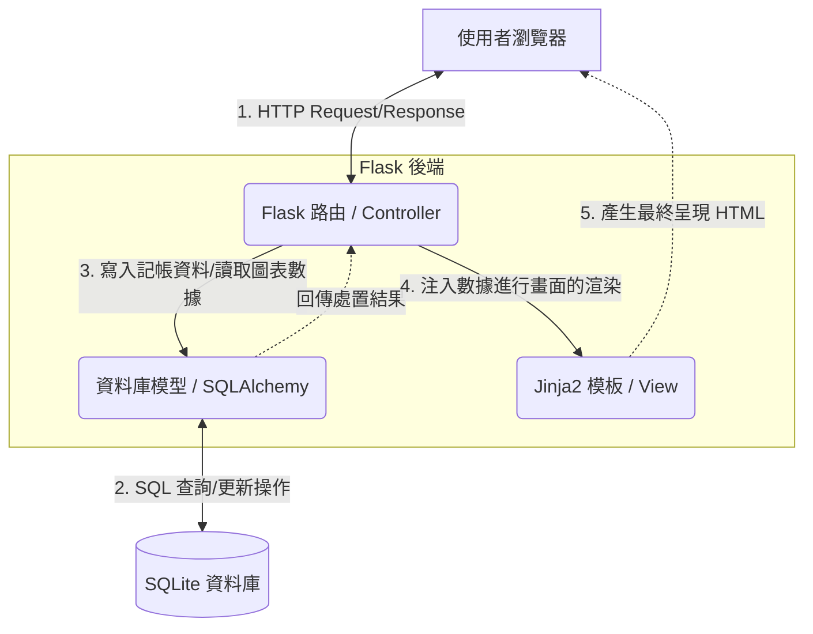

# 系統架構設計文件 (Architecture)：個人記帳簿系統

## 1. 技術架構說明

本系統為輕量級的個人記帳工具，綜合考量開發速度與易維護性，採用以下技術進行構建：

*   **後端框架：Python + Flask**
    *   **原因**：Flask 輕巧彈性，學習曲線低，非常適合做個人小型的 Web 應用開發。
*   **模板引擎：Jinja2**
    *   **原因**：與 Flask 高度整合，能直接將後端資料注入 HTML，透過伺服器端渲染 (SSR) 快速提供頁面，不需要複雜的前端框架設定。
*   **資料庫：SQLite (搭配 SQLAlchemy)**
    *   **原因**：輕量級預設的關聯式資料庫，不需要獨立架設伺服器，資料儲存在單一檔案中，非常適合中小型應用。搭配 SQLAlchemy 會讓資料庫操作更加物件導向且方便。
*   **不需要前後端分離**：考量到此專案的複雜度，頁面統一由 Flask 處理邏輯後，透過 Jinja2 一起渲染，大幅降低初期開發與後續的維護成本。

### 採用 MVC 模式架構
系統實作雖然直接以 Flask 框架呈現，但在架構上遵循 MVC (Model-View-Controller) 的設計概念：
*   **Model (模型)**：負責與 SQLite 資料庫溝通。定義資料表結構，並處理背後的商業邏輯（例如結算帳戶餘額、按類別匯總開銷）。
*   **View (視圖)**：負責呈現使用者介面。利用 Jinja2 將使用者介面 (HTML/CSS) 以及 Controller 傳遞下來的資料組合，顯示給使用者。
*   **Controller (控制器 / Flask Routes)**：接收使用者的請求 (如點選報表、提交記帳表單)，決定提取或儲存哪個 Model 資料，最終選擇適當的 Jinja2 Template 來渲染並傳回結果。

---

## 2. 專案資料夾結構

本專案採用將核心程式碼收納於 `app/` 資料夾內的模組化目錄結構（類似 Application Factory 模式），不僅乾淨，也有助於日後擴充。

```text
personal_expense_tracker/
├── app/                        ← 應用程式主目錄
│   ├── __init__.py             ← 初始化 Flask 應用與資料庫套件連線
│   ├── models/                 ← 資料庫模型 (Model)
│   │   └── schemas.py          ← 用戶、帳戶、記帳與預算等 ORM 模型定義
│   ├── routes/                 ← Flask 路由 (Controller)，建議搭配 Blueprint
│   │   ├── auth.py             ← 使用者登入/註冊/驗證的路由
│   │   └── expense.py          ← 記帳、報表、預算等核心邏輯路由
│   ├── templates/              ← HTML 頁面模板 (View)
│   │   ├── base.html           ← 基礎模板 (包含共同導覽列與 footer)
│   │   ├── dashboard.html      ← 總覽儀表板 (含圖表)
│   │   └── expense_form.html   ← 記帳輸入表單
│   └── static/                 ← 靜態資源目錄
│       ├── css/style.css       ← 網站共用自訂樣式
│       └── js/main.js          ← 前端互動行為與圖表繪製控制
├── instance/                   ← 隱含的機密檔案、本地資料存放處 (忽略於 Git)
│   └── database.db             ← SQLite 本機資料庫存放位置
├── docs/                       ← 專案開發輔助文件
│   ├── PRD.md                  ← 產品需求文件
│   └── ARCHITECTURE.md         ← 系統架構文件 (本文件)
├── requirements.txt            ← 專案所需 Python 套件清單包
└── app.py                      ← 專案進入點，執行此檔案即可啟動本地伺服器
```

---

## 3. 元件關係圖

以下展示各系統元件如何處理一筆使用者的請求操作（例如送出了一筆記帳紀錄）：



---

## 4. 關鍵設計決策

1.  **採用 SQLAlchemy 作為 ORM 框架**
    *   **原因**：直接寫 Raw SQL 會導致程式碼難以維護，並且可能面臨安全性挑戰 (如 SQL Injection)。使用 SQLAlchemy ORM 可以讓開發者將資料表視為 Python 對象來操作，帶來極大的便利與安全保障。
    
2.  **一體化渲染，棄用前後端分離 RESTful API 模式**
    *   **原因**：此專案是以輕量級、快速構建為目標。如果不撰寫獨立的 React/Vue 專案，改為完全由 Flask SSR 端直接生成頁面，可以避免維護兩套系統並大幅縮短開發週期，也順應目前技術與需求現況。

3.  **使用 Blueprints 對路由模組化**
    *   **原因**：即便是小型專案，如果不加以區隔所有路由而全部寫入單一 `app.py` 中將成為未來的噩夢。根據「登入驗證 (auth)」與「記帳邏輯 (expense)」進行功能性拆分，利用 Flask Blueprint 負責註冊路由，維護時便可迅速定位。

4.  **基礎 Template (`base.html`) 介面繼承**
    *   **原因**：為遵循 DRY (Don't Repeat Yourself) 原則，全站頁面的共同佈局（像是 `<head>` 中的資源載入、網頁上方的導覽列列等）將獨立存入 `base.html`，其餘頁面使用繼承語法套用，確保修改版面時不再需要每頁更動。
