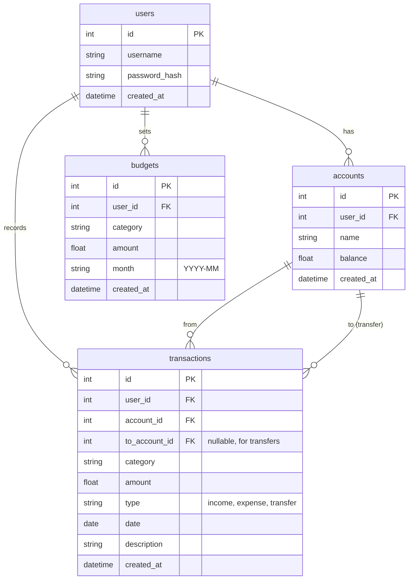

# 資料庫設計文件 (DB Design)

## 1. ER 圖（實體關係圖）

## 2. 資料表詳細說明

### `users` (使用者表)
紀錄系統使用者的帳號密碼資訊，用於登入驗證。
*   `id`: `INTEGER PRIMARY KEY AUTOINCREMENT` - 唯一識別碼
*   `username`: `TEXT` (必填, Unique) - 使用者帳號 (或信箱)
*   `password_hash`: `TEXT` (必填) - 加密後的使用者密碼 (Bcrypt)
*   `created_at`: `DATETIME` (必填, 預設為當下時間) - 帳號建立時間

### `accounts` (資金帳戶表)
對應使用者不同的資金來源，如現金、銀行帳戶、信用卡等。
*   `id`: `INTEGER PRIMARY KEY AUTOINCREMENT` - 唯一識別碼
*   `user_id`: `INTEGER` (必填, FK references users.id) - 所屬使用者
*   `name`: `TEXT` (必填) - 帳戶名稱
*   `balance`: `REAL` (必填, 預設 0.0) - 目前餘額
*   `created_at`: `DATETIME` (必填) - 建立時間

### `transactions` (記帳明細表)
紀錄所有的開銷、收入與內部轉帳。由於 Flowchart 與業務邏輯，統整至一張表並利用 `type` 區分。
*   `id`: `INTEGER PRIMARY KEY AUTOINCREMENT` - 唯一識別碼
*   `user_id`: `INTEGER` (必填, FK references users.id) - 所屬使用者
*   `account_id`: `INTEGER` (必填, FK references accounts.id) - 關聯的扣款/入帳資金帳戶
*   `to_account_id`: `INTEGER` (選填, FK references accounts.id) - 若為轉帳，對應的目標資金帳戶
*   `category`: `TEXT` (必填) - 分類 (例如：餐飲、交通、薪水)
*   `amount`: `REAL` (必填) - 金額 (永遠為正數)
*   `type`: `TEXT` (必填) - 紀錄類型 (`expense`: 支出, `income`: 收入, `transfer`: 轉帳)
*   `date`: `DATE` (必填) - 發生日期
*   `description`: `TEXT` (選填) - 備註說明
*   `created_at`: `DATETIME` (必填) - 建立時間

### `budgets` (預算表)
紀錄使用者設定的預算目標。
*   `id`: `INTEGER PRIMARY KEY AUTOINCREMENT` - 唯一識別碼
*   `user_id`: `INTEGER` (必填, FK references users.id) - 所屬使用者
*   `category`: `TEXT` (必填) - 預算分類名稱，可設為 "All" 代表總預算
*   `amount`: `REAL` (必填) - 預算上限金額
*   `month`: `TEXT` (必填) - 套用的月份，格式如 "YYYY-MM"
*   `created_at`: `DATETIME` (必填) - 建立時間
