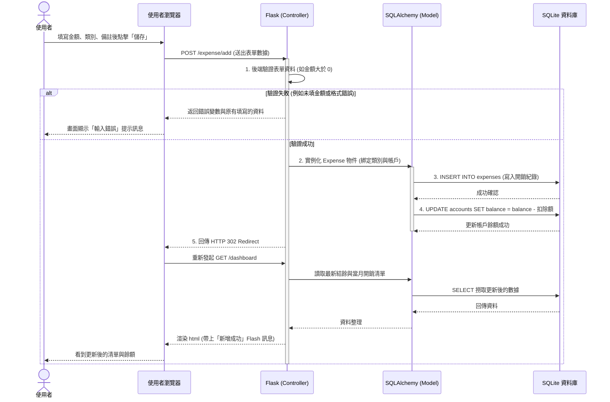

# 流程圖與系統資料流 (Flowchart)：個人記帳簿系統

## 1. 使用者流程圖 (User Flow)

此圖展示使用者在網站中可能的操作路徑與流程，涵蓋記帳、報表檢視、設定預算及管理帳戶等核心行為。

```mermaid
flowchart LR
    Start([使用者到達網站]) --> Dashboard[總覽儀表板\n(當月結餘與快速圖表)]
    
    Dashboard --> ActionChoice{想執行什麼操作？}
    
    %% 記帳流程
    ActionChoice -->|1. 記一筆| ExpenseForm[填寫記帳表單]
    ExpenseForm --> SaveExpense[送出儲存]
    SaveExpense --> Dashboard
    
    %% 歷史與編輯刪除流程
    ActionChoice -->|2. 管理歷史紀錄| ExpenseList[記帳歷史列表]
    ExpenseList --> EditExpense[編輯紀錄]
    EditExpense --> SaveUpdate[儲存變更]
    SaveUpdate --> ExpenseList
    ExpenseList --> DeleteExpense[刪除紀錄]
    DeleteExpense --> ExpenseList
    ExpenseList --> Dashboard
    
    %% 報表與統計
    ActionChoice -->|3. 深入統計| ReportPage[統計分析頁面\n(週/月/年切換)]
    ReportPage --> Dashboard

    %% 帳戶管理
    ActionChoice -->|4. 帳戶資產管理| AccountManage[資產帳戶管理頁\n(檢視各帳戶餘額)]
    AccountManage --> AddAccount[新增/變更帳戶]
    AddAccount --> SaveAccount[儲存帳戶變更]
    SaveAccount --> AccountManage
    AccountManage --> Dashboard
    
    %% 預算設定
    ActionChoice -->|5. 預算控制| BudgetConfig[預算設定頁\n(檢視超支狀況/修改金額)]
    BudgetConfig --> SaveBudget[儲存預算設定]
    SaveBudget --> BudgetConfig
```

## 2. 系統序列圖 (Sequence Diagram)

以「使用者點擊新增並送出一筆新消費紀錄」為例，展示從瀏覽器到資料庫的資料流動與驗證過程。



## 3. 功能清單對照表

將上述各流程所對應的 URL 路徑與 HTTP 方法整理如下，供後續開發路由與 API 實作時作為藍圖：

| 功能大項 | 具體操作 / 動作 | URL 路徑 | HTTP 方法 | 說明 |
| --- | --- | --- | --- | --- |
| **總覽** | 檢視儀表板首頁 | `/` 或是 `/dashboard` | GET | 顯示主要數據、當月收支摘要與最新幾筆明細 |
| **記帳紀錄** | 進入記帳表單頁面 | `/expense/add` | GET | 顯示單筆收支的輸入表單 |
| | 提交新記帳紀錄 | `/expense/add` | POST | 接收表單並將消費/收入明細寫入資料庫 |
| | 查詢所有歷史紀錄 | `/expense/history` | GET | 列出歷史紀錄，可能附帶月份篩選器或分頁功能 |
| | 進入編輯紀錄頁面 | `/expense/edit/<id>` | GET | 顯示原先填寫的該筆資料以供修改 |
| | 提交修改後的紀錄 | `/expense/edit/<id>` | POST | 更新特定 `id` 的紀錄 |
| | 刪除單筆紀錄 | `/expense/delete/<id>` | POST | 安全地刪除指定紀錄 (以 POST 調用防止 CSRF 即便未使用 DELETE Method) |
| **統計分析** | 查詢統計報表 | `/report` | GET | 可帶 Query Parameter 來顯示指定月份區間的趨勢圖與圓餅圖 |
| **帳戶管理** | 列出與檢視帳戶 | `/account` | GET | 顯示所有個人資金帳戶與其目前餘額 |
| | 新增一筆自訂帳戶 | `/account/add` | POST | 新建立資金帳戶 (如悠遊卡、網銀等) |
| **預算控制** | 檢視與調整預算 | `/budget` | GET | 顯示每月的預算上限與本月進度條 |
| | 儲存預算設定參數 | `/budget/update` | POST | 修改總預算或各類別預算上限並寫入資料庫 |
